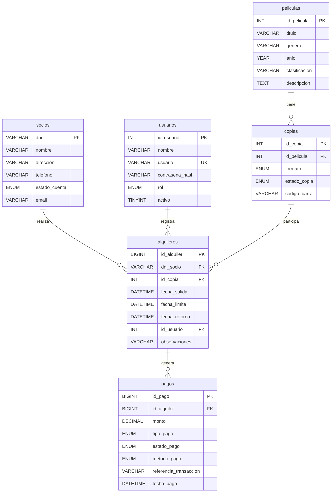
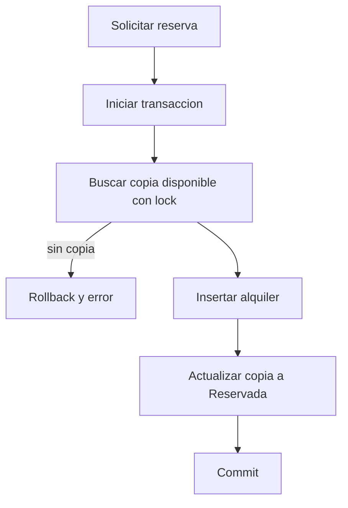
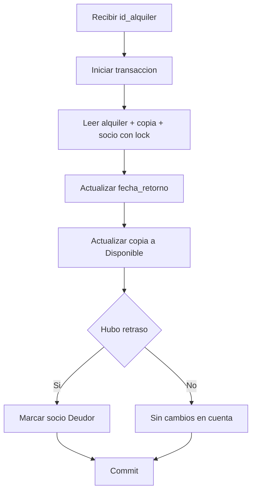

# Cinemateca - Base de Datos

Documentacion tecnica del modelo relacional usado por la aplicacion.

## Archivos fuente
- Esquema: `database.sql`
- Datos de prueba: `insert_test_data.sql`

## Motor y convenciones
- Motor: InnoDB
- Charset: utf8mb4
- Integridad referencial por claves foraneas
- Campos de auditoria `creado_en` y `actualizado_en`

## Entidades
- `peliculas`
  - `id_pelicula` (PK)
  - `titulo`, `genero`, `anio`, `clasificacion`, `descripcion`
- `socios`
  - `dni` (PK)
  - `nombre`, `direccion`, `telefono`, `estado_cuenta`, `email`
- `usuarios`
  - `id_usuario` (PK)
  - `usuario` (UNIQUE), `contrasena_hash`, `rol`, `activo`
- `copias`
  - `id_copia` (PK)
  - `id_pelicula` (FK), `formato`, `estado_copia`, `codigo_barra`
- `alquileres`
  - `id_alquiler` (PK)
  - `dni_socio` (FK), `id_copia` (FK), `id_usuario` (FK nullable)
  - `fecha_salida`, `fecha_limite`, `fecha_retorno`, `observaciones`
- `pagos`
  - `id_pago` (PK)
  - `id_alquiler` (FK)
  - `monto`, `tipo_pago`, `estado_pago`, `metodo_pago`, `referencia_transaccion`, `fecha_pago`

## Diagrama entidad-relacion

## Estados de negocio
- `copias.estado_copia`
  - `Disponible`
  - `Alquilada`
  - `Reservada`
  - `Reparacion`
- `socios.estado_cuenta`
  - `Activo`
  - `Deudor`
- `pagos.tipo_pago`
  - `Alquiler`
  - `Multa`
- `pagos.estado_pago`
  - `Pendiente`
  - `Pagado`

## Indices relevantes
- `peliculas.idx_peliculas_titulo`
- `socios.idx_socios_dni`
- `copias.idx_copias_estado_copia`
- `alquileres.idx_alquileres_dni_socio`
- `alquileres.idx_alquileres_id_copia`
- `pagos.idx_pagos_id_alquiler`
- `pagos.idx_pagos_estado_pago`

## Flujo transaccional: reserva

## Flujo transaccional: devolucion

## Bootstrap de la base
1. Aplicar esquema y semilla con:
   - `pnpm db:setup`
2. Flujo manual (alternativo):
   - ejecutar `database.sql`
   - ejecutar `insert_test_data.sql`

## Consultas operativas utiles
- Alquileres activos:
  - `SELECT * FROM alquileres WHERE fecha_retorno IS NULL;`
- Alquileres vencidos:
  - `SELECT * FROM alquileres WHERE fecha_retorno IS NULL AND fecha_limite < NOW();`
- Copias disponibles:
  - `SELECT * FROM copias WHERE estado_copia = 'Disponible';`
- Deuda pendiente por alquiler:
  - `SELECT * FROM pagos WHERE estado_pago = 'Pendiente';`
