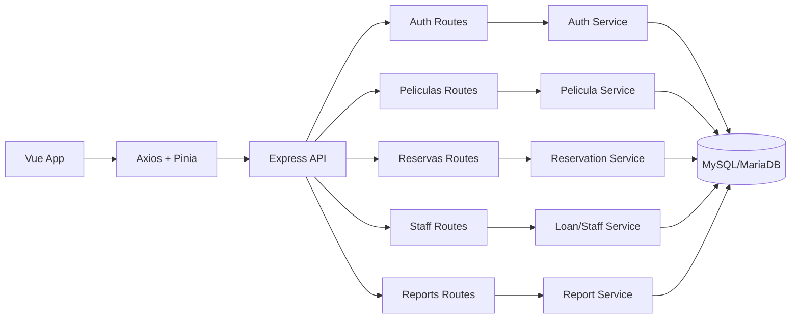
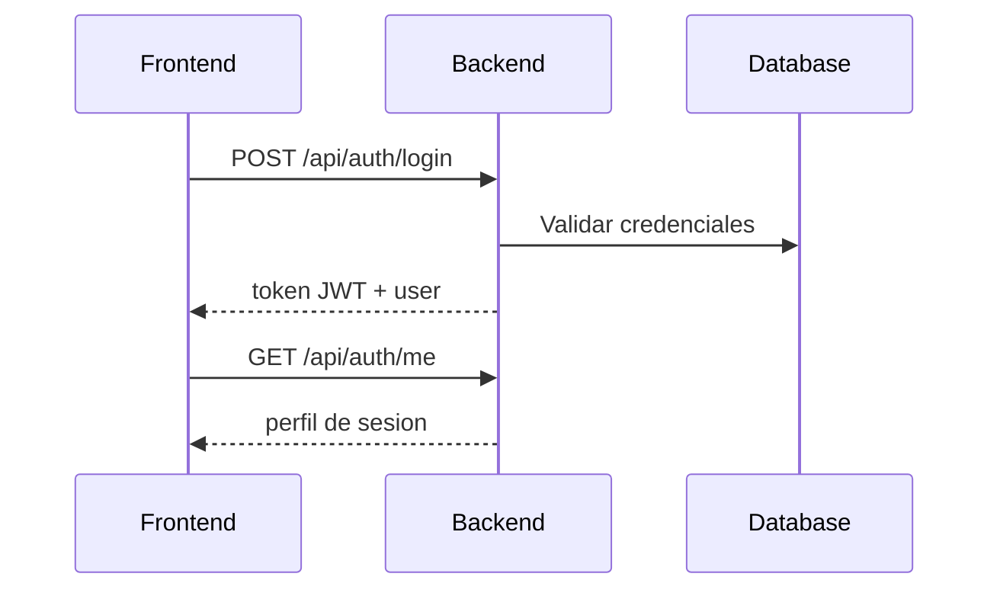
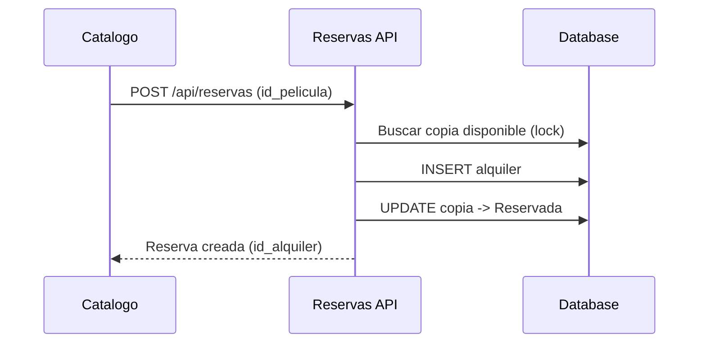
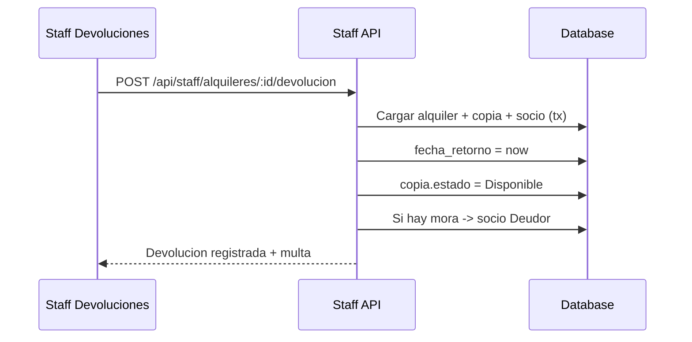

# Cinemateca

Aplicacion full stack para gestion de videoclub con catalogo, reservas, historial de socios, devoluciones y panel operativo para staff.

## Stack
- Frontend: Vue 3, TypeScript, Pinia, Vue Router, Axios, Vite.
- Backend: Node.js, Express, Sequelize, mysql2.
- Auth: JWT (`jsonwebtoken`) y `bcryptjs`.
- Testing: Vitest.

## Modulos
- Socio:
    - Ver catalogo.
    - Crear reservas.
    - Consultar historial.
- Staff (Vendedor/Admin):
    - Ver resumen operativo.
    - Consultar socios.
    - Registrar devoluciones.

## Arquitectura general

## Flujos clave

### Login

### Reserva por socio

### Devolucion por staff

## Endpoints principales
- Health:
    - `GET /health`
- Auth:
    - `POST /api/auth/login`
    - `GET /api/auth/me`
- Peliculas:
    - `GET /api/peliculas`
- Reservas:
    - `POST /api/reservas`
    - `GET /api/reservas/historial`
- Staff:
    - `GET /api/staff/resumen`
    - `GET /api/staff/socios`
    - `POST /api/staff/alquileres/:idAlquiler/devolucion`
- Reportes:
    - `GET /api/reports/critical-inventory`

## Estructura del repo
- `src/`: frontend.
- `server/`: backend.
- `database.sql`: esquema de base de datos.
- `insert_test_data.sql`: datos de prueba.
- `scripts/db-setup.mjs`: bootstrap completo de DB.

## Requisitos
- Node: `^20.19.0 || >=22.12.0`
- pnpm
- MySQL/MariaDB local

## Preparacion para otro equipo
Antes de ejecutar el proyecto en otra computadora:
1. Copia el repositorio.
2. Crea un archivo `.env` basado en [.env.example](.env.example).
3. Ajusta credenciales de base de datos y `JWT_SECRET` si hace falta.
4. Ejecuta `pnpm install`.
5. Ejecuta `pnpm db:setup`.
6. Ejecuta `pnpm dev`.

Si cambias el host o puerto del backend, actualiza `VITE_API_BASE_URL` en el `.env`.

## Instalacion y ejecucion
1. Instalar dependencias:
     - `pnpm install`
2. Levantar todo (DB + backend + frontend):
     - `pnpm dev`

`pnpm dev` ejecuta:
1. `pnpm db:setup`
2. backend en watch (`server/start.js`)
3. frontend Vite

## Scripts
- `pnpm dev`
- `pnpm dev:start`
- `pnpm dev:server`
- `pnpm dev:client`
- `pnpm db:setup`
- `pnpm test`
- `pnpm type-check`
- `pnpm build`

## Variables de entorno
- `DB_HOST`
- `DB_USER`
- `DB_PASSWORD`
- `DB_NAME`
- `JWT_SECRET`
- `PORT`

Consulta [.env.example](.env.example) para ver el formato esperado.

## Documentacion de base de datos
Ver [README.database.md](README.database.md) para el modelo relacional, reglas y diagramas ER.

## Checklist antes de subir a GitHub
- [ ] Verificar que [.env](.env) exista solo en tu PC y no se suba al repo.
- [ ] Confirmar que [.env.example](.env.example) tenga todas las variables necesarias.
- [ ] Ejecutar `pnpm install`.
- [ ] Ejecutar `pnpm db:setup` y validar que la base `cinemateca` se crea bien.
- [ ] Ejecutar `pnpm test`.
- [ ] Ejecutar `pnpm type-check`.
- [ ] Ejecutar `pnpm build`.
- [ ] Probar `pnpm dev` y revisar login, catalogo, reservas, historial y devoluciones.
- [ ] Revisar que no queden logs temporales de depuracion.
- [ ] Confirmar que el backend lea variables de entorno y no credenciales hardcodeadas.
- [ ] Confirmar que el frontend use `VITE_API_BASE_URL`.
- [ ] Hacer `git status` y verificar que no se incluyan archivos sensibles.